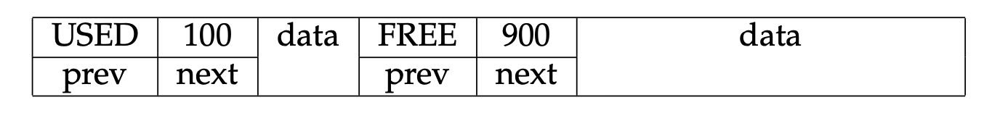
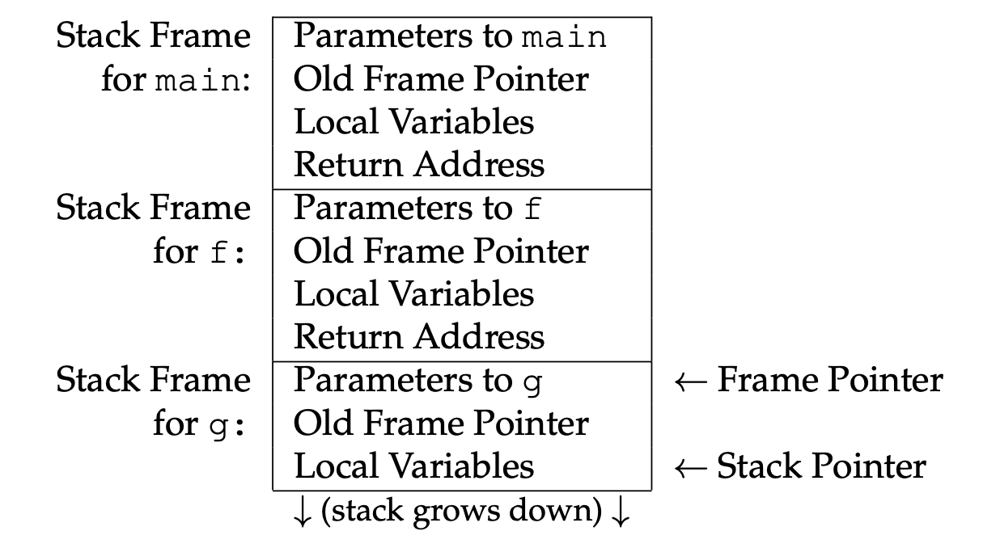
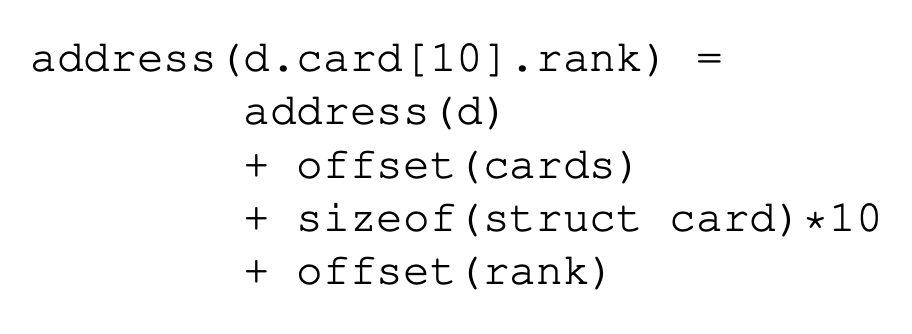

# 9. Organização de Memória

(Tradução do capítulo 9 do livro do Douglas Thain)

- Objetivo: Estudar algumas técnicas para estruturar código executável.


Questão: Como a memória interna de um programa em execução é disposta?

## Segmentação Lógica

Um programa convencional vê a memória como uma sequência linear de palavras, cada uma
com um endereço numérico começando em zero e aumentando até um número
grande (por exemplo, 4 GB em um processador de 32 bits).


Em princípio, a CPU é livre para usar a memória da maneira que achar melhor. 
Código e dados podem ser espalhados e misturados pela memória em qualquer ordem
que seja conveniente. É até tecnicamente possível para uma CPU modificar a
memória que contém seu código enquanto ela está em execução. É evidente que
programar dessa maneira seria complexo, confuso e difícil de depurar.

Em vez disso, a memória de programa é comumente organizada separando-a em
**segmentos lógicos**. Cada segmento é um intervalo de endereços sequenciais, dedicado
a uma finalidade específica dentro do programa. Os segmentos são normalmente
organizados nesta ordem:


- O **segmento de código** (também conhecido como segmento de texto) contém o 
código de máquina do programa, correspondendo aos corpos de funções em um programa em C.

- O **segmento de dados** contém os dados globais do programa, que correspondem 
às variáveis globais em um programa em C. O segmento de dados pode ser subdividido 
em dados de leitura e escrita (variáveis) e dados somente de leitura (constantes).

- O **segmento de heap** contém a heap, área da memória gerenciada dinamicamente 
em tempo de execução por malloc e free em um programa em C, ou new e delete 
em outras linguagens. O topo da heap é historicamente conhecido como o ```break```.

- O **segmento de pilha** contém a pilha, que registra o estado de execução atual 
do programa, bem como as variáveis locais em uso.

Typically, the heap grows “up” from lower addresses to higher ad-
dresses, while the stack grows “down” from higher to lower. In between
the two segments is an invalid region of memory that is unused until over-
taken by one segment or the other.
On a simple computer such as an embedded machine or microcon-
troller, logical segments are nothing more than an organizational conven-
tion: nothing stops the program from using memory improperly. If the
heap grows too large, it can run into the stack segment (or vice versa), the
program will crash (if you are lucky) or suffer silent data corruption (if
you are unlucky).


Em um sistema operacional com multiprogramação e proteção de memória, 
cada processo em execução no sistema operacional tem seu próprio espaço de memória privado, 
com a ilusão de começar no endereço zero e se estender até um endereço alto. 
Como resultado, cada processo pode acessar sua própria memória arbitrariamente, 
mas é impedido de acessar ou modificar outros processos. 
Dentro de seu próprio espaço, cada processo define seu
próprio código, dados, heap e segmentos de pilha.


In some operating systems, when a program is initially loaded into
memory, permissions are set on each range of memory corresponding to
its purpose: memory corresponding to each segment can be set appropriately:
read-write for data, heap, and stack; read-only for constants; 
read-execute for code; and none for the unused area.

The permissions on the logical segments also protect a process from
damaging itself in certain ways. For example, code cannot be modified
at runtime because it is marked read/execute, while items on the heap
cannot be executed, because they are marked read/write. (To be clear, this
only prevents against accidents, not malice; a program can always ask the
operating system to change the permissions on one of its own pages. For
an example, look up the mprotectsystem call in Unix.)
If a process attempts to access memory in a prohibited way or attempts
to access the unused area, a page fault occurs. This forces a transfer of
control to the OS, which considers the process and the faulting address. If
the access indicates a violation of the logical segmentation of the program,
then the process is forcibly killed with the error message segmentation
fault.

Initially, a process is given a small amount of memory for the heap
segment, which it manages internally to implement mallocand free. If
this area is exhausted and the program still needs more, it must explicitly
request it from the operating system. On traditional Unix systems, this
is done with the brk system call, which requests that the heap segment
be extended to a new address. If the OS agrees, then it will allocate new
pages at the beginning of the invalid area, effectively extending the heap
segment. If the OS does not agree, then brk will return an error code,
causing mallocto return an error (indicated as a null pointer) which the
program must handle.

The stack has a similar problem, in that it must be able to grow down.
It is not so easy for a program to determine exactly when more stack is
needed, because that happens whenever a new function is invoked, or new
local variables are allocated. Instead, modern operating systems maintain
a guard page at the top of the invalid area, adjacent to the current stack.
When a process attempts to extend the stack into the invalid area, a page
fault occurs, and control is transferred to the OS. If the OS sees that the
faulting address is in the guard page, it can simply allocate more pages
for the stack, set the page permissions appropriately, and move the guard
page down to the new top of the invalid area.

Of course, there are limits on how big the heap and the stack may grow;
every OS implements policies controlling how much memory any process
or user may consume. If any of these policies are violated, the OS may
decline to extend the memory of the process.

The idea of breaking a program into segments is so powerful and use-
ful that it was common for many decades to have the concept implemented
in hardware. (If you have taken a class in computer architecture and op-
erating systems, you have probably studied this in some detail.) The basic
idea is that the CPU maintains a table of segments, recording the starting
address and length, along with the permissions associated with each seg-
ment. The operating system would typically set up a hardware segment
to correspond to the logical organization just described.

Although hardware segmentation was widely used in operating sys-
tems through the 1980s, it has been largely replaced by paging, which
was seen as simpler and more flexible. Processor vendors have responded
by removing support for hardware segmentation in new designs. For ex-
ample, every generation of the Intel X86 architecture from the 8086 up to
the Pentium supported segmentation in 32-bit protected mode. The latest
64-bit architectures provide only paging facilities, and no segmentation.
Logical segmentation continues as a useful way to organize programs in
memory.

## Gerenciamento da "Heap"

The heap contains memory that is managed dynamically at runtime. The
OS does not control the internal organization of the heap, except to limit
its total size. Instead, the internal structure of the heap is managed by the
standard library or other runtime support software that is automatically
linked into a program. In a C program, the functions malloc and free al-
locate and release memory on the heap, respectively. In C++, new and
delete have the same effect. Other languages manipulate the heap implic-
itly when objects and arrays are created and deleted.

The simplest implementation of malloc and free is to treat the entire
heap as one large linked list of memory regions. Each entry in the list
records the state of the region (free or in use), the size of the region, and
has pointers to the previous and next regions. Here’s what that might look
like in C:

```
struct chunk {
   enum { FREE, USED } state;
   int size;
   struct chunk *next;
   struct chunk *prev;
   char data[0];
};
```

(Note that we declared dataas an array of length zero. This is a little
trick that allows us to treat dataas a variable length array, provided that
the underlying memory is actually present.)
Under this scheme, the initial state of the heap is simply one entry in a
linked list:


Suppose that the user calls malloc(100)to allocate 100 bytes of mem-
ory. mallocwill see that the (single) chunk of memory is free, but much
larger than the requested size. So, it will split it into one small chunk of
100 bytes and one larger chunk with the remainder. This is accomplished
by simply writing a new chunk header into the data area after 100 bytes.
Then, connect them together into a linked list:



Once the list has been modified, malloc returns the address of the
data element within the chunk, so that the user can access it directly. It
doesn’t return the linked list node itself, because the user doesn’t need to
know about the implementation details. If there is no chunk available that
is large enough to satisfy the current request, then the process must ask
the OS to extend the heap by calling brk.

When the user calls freeon a chunk of memory, the state of the chunk
in the linked list is marked FREE, and then merged with adjacent nodes, if
they are also free.

(Incidentally, now you can see why it is dangerous for a program to
modify memory carelessly outside a given memory chunk. Not only could
it affect other chunks, but it could damage the linked list itself, resulting
in wild behavior on the next mallocor free!)

If the program always frees memory in the opposite order that it was
allocated, then the heap will be nicely split into allocated and free memory.
However, that isn’t what happens in practice: memory can be allocated
and freed in any order. Over time, the heap can degenerate into a mix
of oddly sized chunks of allocated and freed memory. This is known as
**memory fragmentation**.

Excessive fragmentation can result in waste: if there are many small
chunks available, but none of them large enough to satisfy the current
malloc, then the process has no choice but to extend the heap, leaving
the small pieces unused. This increases pressure on total virtual memory
consumption in the operating system.

In a language like C, memory chunks cannot be moved while in use,
and so fragmentation cannot be fixed after it has already occurred. 
However, the memory allocator has some limited ability to avoid fragmenta-
tion by choosing the location of new allocations with care. Some simple
strategies are easy to imagine and have been studied extensively:

- Best Fit. On each allocation, search the entire linked list and find the
smallest free chunk that is larger than the request. This tends to leave
large spaces available, but generates tiny leftover free fragments that
are too small to be used.

- Worst Fit. On each allocation, search the entire linked list and find
the largest free chunk that is larger than the request. Somewhat coun-
terintuitively, this method tends to reduce fragmentation by avoid-
ing the creation of tiny unusable fragments.

- First Fit. On each allocation, search the linked list from the begin-
ning, and find the first fragment (large or small) that satisfies the
request. This performs less work than Best Fit or Worst Fit, but per-
forms an increasing amount of work as the linked list increases in
size.

- Next Fit. On each allocation, search the linked list from the last ex-
amined location, and find the next fragment (large or small) that sat-
isfies the request. This minimizes the amount of work done on each
allocation, while distributing allocations throughout the heap.

For general purpose allocators where one cannot make assumptions
about application behavior, the conventional wisdom is that Next Fit 
results in good performance with an acceptable level of fragmentation.


## Gerenciamento da Pilha ("Stack") 

The **stack** is used to record the current state of the running program. Most
CPUs have a specialized register – the stack pointer – which stores the
address where the next item will be pushed or popped. Because the stack
grows down from the top of memory, there is a confusing convention:
pushing an item on the stack causes the stack pointer to move to a lower
numbered address, while popping an item off the stack causes the stack
pointer to move to a higher address. The “top” of the stack is actually at
the lowest address!

Each invocation of a function occupies a range of memory in the stack,
known as a **stack frame**. The stack frame contains the parameters and
the local variables used by that function. When a function is called, a
new stack frame is pushed; when the function returns, the stack frame
is popped, and execution continues in the caller’s stack frame.

Another specialized register known as the frame pointer (or sometimes 
**base pointer**) indicates the beginning of the current frame.
Code within a function relies upon the frame pointer to identify the location of
the current parameters and local variables.

For example, suppose that the mainfunction calls function f, and then
f calls g. If we stop the program in the middle of executing g, the stack
would look like this:



The order and details of the elements in a stack frame differ somewhat
between CPU architectures and operating systems. As long as both the
caller and the callee agree on what goes in the stack frame, then any func-
tion may call another, even if they were written in different languages, or
built by different compilers.

The agreement on the contents of the activation record is known as a
**calling convention**. This is typically written out in a detailed technical
document that is used by the designers of compilers, operating systems,
and libraries to ensure that code is mutually interoperable.

There are two broad categories of calling conventions, with many op-
portunities for variation in between. One is to put the arguments to a
function call on the stack, and the other is to place them in registers.

###  Stack Calling Convention

The conventional approach to calling a function is to push the arguments
to that function on the stack (in reverse order), and then to jump to the
address of the function, leaving behind a return address on the stack. Most
CPUs have a specialized CALLinstruction for this purpose. For example,
the assembly code to call f(10,20)could be as simple as this:

```
PUSH $20
PUSH $10
CALL f
```
When f begins executing, it saves the old frame pointer currently in
effect and makes space for its own local variables. As a result, the stack
frame for f(10,20)looks like this:


To access its arguments or local variables, fmust load them from mem-
ory relative to the frame pointer. As you can see, the function arguments
are found at fixed positions above the frame pointer, while local variables
are found below the frame pointer. 

### Register Calling Convention

An alternate approach to calling a function is to put the arguments into
registers, and then call the function. For example, let us suppose that our
calling convention indicates that registers %R10, %R11, etc are to be used
for arguments. Under this calling convention, the assembly code to invoke
f(10,20)might look like this:


```
MOVE $10 -> %R10
MOVE $20 -> %R11
CALL f
```

When fbegins executing, it still must save the old frame pointer and
make room for local variables. It doesn’t have to load arguments from the
stack; it simply expects the values in %R10 and %R11 and can compute
on them right away. This could confer a significant speed advantage by
avoiding memory accesses.

But, what if f is a complex function that needs to invoke other func-
tions? It will still need to save the current values of the argument registers,
in order to free them up for its own use.

To allow for this possibility, the stack frame for fmust leave space for
the arguments, in case they must be saved. The calling convention must
define the location of the arguments, and they are typically stored below
the return address and old frame pointer, like this:


What happens if the function has more arguments then there are reg-
isters set aside for arguments? In this case, the additional arguments are
pushed on to the stack, as in the stack calling convention.

In the big picture, the choice between stack and register calling conven-
tions doesn’t matter much, except that all parties must agree on the details
of the convention. The register calling convention has the slight advan-
tage that a leaf function (a function that does not call other functions) can
compute a simple result without accessing memory. Typically, the regis-
ter calling convention is used on architectures that have a large number of
registers that might otherwise go unused.

It is possible to mix the conventions in a single program, as long as
both caller and callee are informed of the distinction. For example, the
Microsoft X86 compilers allow keywords in function prototypes to select a
convention: cdeclselects the stack calling convention, while fastcall
uses registers for the first two arguments.


## Localização de Dados

Para cada tipo de dado em um programa, deve haver um método inequívoco
de localização desses dados na memória. 
O compilador deve gerar um cálculo de endereço,
usando as informações básicas disponíveis sobre o símbolo. 
O cálculo varia de acordo com a classe de armazenamento dos dados:

- Global data has the easiest address computation. In fact, the compiler
doesn’t usually compute global addresses, but rather passes the name of 
each global symbol to the assembler, which then selects the address computation. 
In the simplest case, the assembler will generate an **absolute address** 
giving the exact location of the data in program memory.

However, the simple approach isn’t necessarily efficient, because an
absolute address is a full word (e.g. 64 bits), the same size as an
instruction in memory. This means that the assembler must use several
instructions (RISC) or multi-word instructions (CISC) to load the address
into a register. Assuming that most programs don’t use the entire address space, 
it isn’t usually necessary to use the entire word.

An alternative is to use a base-relative address that consists of a base
address given by a register plus a fixed offset given by the assembler.
For example, global data addresses could be given by a register 
indicating the beginning of the data segment, plus a fixed offset, 
while a function address could be given by a register indicating the
beginning of the code segment plus a fixed offset. 
Such an approach can be used in dynamically loaded libraries, when the 
location of the library is not fixed in advance, but the location of 
a function within the library is known.

Yet another approach is to use a **PC-relative address** in which the
exact distance in bytes between the referring instruction and the target
data is computed, and then encoded into the instruction. 
This works as long as the relative distance is small enough (e.g. 16 bits)
to fit into the address field of the instruction. This task is performed
by the assembler and is usually invisible to the programmer.

- **Local data** works differently. Because local variables are stored on
the stack, a given local variable does not necessarily occupy the same
absolute address each time it is used. If a function is called recursively, 
there may be multiple instances of a given local variable in
use simultaneously! For this reason, local variables are always specified
as an offset relative to the current frame pointer. 
(The offset may be positive or negative, depending on the function calling 
convention.) Function parameters are just a special case of local variables:
a parameter’s position on the stack is given precisely by its ordinal
position in the parameters.

- **Heap data** can only be accessed by way of pointers that are stored
as global or local variables. To access data on the heap, the compiler
must generate an address computation for the pointer itself, 
then de-reference the pointer to reach the item on the heap.

So far, we have only considered atomic data types that are easily stored
in a single word of memory: booleans, integers, floats, and so forth. How-
ever, any of the more complex data types can be placed in any of the three
storage classes, and require some additional handling.

An array can be stored in global, local, or heap memory, and the be-
ginning of the array is found by one of the methods above. An element in
the array is found by multiplying the index by the size of the items in the
array, and adding that to the address of the array itself:


```
address(a[i]) = address(a) + sizeof(type) * i
```

The more interesting question is how to deal with the length of the
array itself. In an unsafe language like C, the simple approach is to simply
do nothing: if the program happens to run off the end of the array, the
compiler will happily compute an address outside the array bounds, and
chaos results. For some applications where performance is paramount, the
simplicity of this approach trumps any increase in safety.

A safer approach is to store the length of the array at the base address
of the array itself. Then, the compiler may generate code that checks the
actual index against the array bounds before generating the address. This
prevents any sort of runtime accident by the programmer. However, the
downside is performance. Every time the programmer mentions a[i],
the resulting code must contain this:

1. Compute address of array a.

2. Load length of ainto a register.

3. Compare array index ito register.

4. If iis outside of array bounds, raise an exception.

5. Otherwise, compute address of a[i]and continue.

This pattern is so common that some computer architectures provide
dedicated support for array bounds checking. The Intel X86 architecture,
(which we will examine in detail in the next chapter) provides a unique
BOUNDinstruction, whose only purpose is to compare a value against two
array bound values, and then raise a unique “Array Bounds Exception” if
it falls outside.

Structures have similar considerations. In memory, a structure is very
much like an array, except that it can contain items of irregular size. To
access an item within a structure, the compiler must generate an address
computation of the beginning of the structure, and then add an offset cor-
responding to the name of item (known as the structure tag) within the
structure. Of course, it is not necessary to perform bounds checking since
the offsets are fixed at compile time.

For complex nested data structures, the address computation necessary
to find an individual element can become quite complicated. For example,
consider this bit of code to represent a deck of cards:


To compute d.cards[10].rank, the compiler must first generate an
address computation for d, depending on whether it is a local or global
variable. From there, the offset of cards is added, then the offset of the
tenth item, then the offset of rankwithin the card. The complete address
computation is:



## Program Loading

Antes de um programa começar a ser executado na memória, 
ele existe primeiro como um arquivo em disco, 
e deve haver uma convenção para carregá-lo na memória. 
Há vários formatos executáveis para organizar um programa em
disco, desde os mais simples até os mais complexos. 

Os sistemas de computador mais simples armazenam um executável 
como um blob binário em disco. 
O código do programa, os dados e o estado inicial da heap e
da pilha são despejados em um arquivo, sem distinção. 
Para executar o programa, o sistema operacional precisa apenas carregar 
o conteúdo do arquivo na memória e então ir para o endereço inicial 
do programa para iniciar a execução.

This approach is about as simple as one can imagine. It does work, but
it has several limitations. One is that the format wastes space on uninitial-
ized data. For example, if the program declares a large global array where
each element has the value zero, then every single zero in that array will
be stored in the file. Another is that the OS has no insight into how the
program intends to use memory, so it is unable to set permissions on each
logical segment, as discussed above. Yet another is that the binary blob
has no identifying information to show that it is an executable.

However, the binary blob approach is still occasionally used in places
where programs are small and simplicity is paramount. For example, the
very first boot stage of PC operating system reads in a single sector from
the boot hard disk containing a binary blob, which then carries out the sec-
ond stage of booting. Embedded systems often have very small programs
measured in a few kilobytes, and rely on binary blobs.

An improved approach used in classic Unix systems for many years
is the a.out executable format. There are many slight variations on the
format, but they all share the same basic structure. The executable file
consists of a short header structure, followed by the text, initialized data,
and symbol table:


The header structure itself is just a few bytes that allow the operating
system to interpret the rest of the file:


The **magic number** is a unique integer that clearly defines the file as an
executable: if the file does not begin with this magic number, the OS will
not even attempt to execute it. Different magic numbers are defined for
executables, unlinked object files, and shared libraries. The text size field
indicates the number of bytes in the text section that follows the header.
The data size field indicates the amount of initialized data that appears in
the file, while the **BSS size** field indicates the amount of uninitialized data.

The uninitialized data need not be stored in the file. Instead it is simply
allocated in memory as part of the data segment when the program is
loaded. The symbol table in the executable lists each of the variable and
function names used in the program along with their locations in the code
and data segment; this permits a debugger to interpret the meaning of
addresses. Finally, the entry point gives the address of the starting point of
the program (typically main) in the text segment. This allows the starting
point to be something other than the first address in the program.

O formato a.out representa uma grande melhoria em relação a um blob binário 
e ainda é utilizado em muitos sistemas operacionais. 
No entanto, não é poderoso o suficiente para suportar recursos necessários para 
linguagens modernas, particularmente bibliotecas carregadas dinamicamente.

O Formato de Ligação Extensível (**Extensible Linking Format - ELF**) 
é utilizado em sistemas operacionais para representar executáveis, arquivos-objeto e 
bibliotecas compartilhadas. Assim como o a.out, um arquivo ELF possui várias seções 
representando código, dados e BSS, mas pode ter um número arbitrário de seções 
adicionais para depuração de dados, código de inicialização e finalização, 
e metadados sobre as ferramentas usadas. 
O número de seções no arquivo supera os segmentos na memória e, portanto, 
uma tabela de seções (**section table**) no arquivo ELF indica 
como várias seções devem ser mapeadas em um único segmento.


## Referências

- Capítulo 9 do livro de Douglas Thain.


## Gerenciamento de recursos em tempo de execução (runtime)

### Recursos em tempo de execução

+ A execução de um programa está inicialmente sob o controle do sistema operacional (SO)
+ Quando um programa é invocado:
   - O SO aloca espaço para o programa
   - O código é carregado em parte do espaço
   - O SO desvia para o ponto de entrada (ou seja, "main").

### Laioute de memória


Tradicionalmente, as imagens da organização da máquina possuem:
- Endereço baixo no topo
- Endereço alto na parte inferior
- Linhas delimitando áreas para diferentes tipos de dados

Tais imagens são simplificações:
- Por exemplo, nem toda memória precisa ser contígua

- O que é "Other Space"?

Contém todos os dados para o programa

- O compilador é responsável por:
   + Geração de código
   + Orquestração do uso da área de dados

### Objetivos da geração de código

### Premissas sobre execução

### Ativações

### Tempo de vida de variáveis

### Árvores de ativação

### Laioute de memória revisado

### Registros de ativação

### Laioute de memória com dados estáticos

### Armazenamento na "Heap"

###  Laioute de memória com a "Heap"


## Stack Machines

+ Um modelo de avaliação simples:
   - Sem variáveis ou registros
   - Uma pilha de valores para resultados intermediários
+ Cada instrução:
   - Pega seus operandos do topo da pilha
   - Remove esses operandos da pilha
   - Executa a operação necessária com eles
   - Coloca o resultado na pilha


